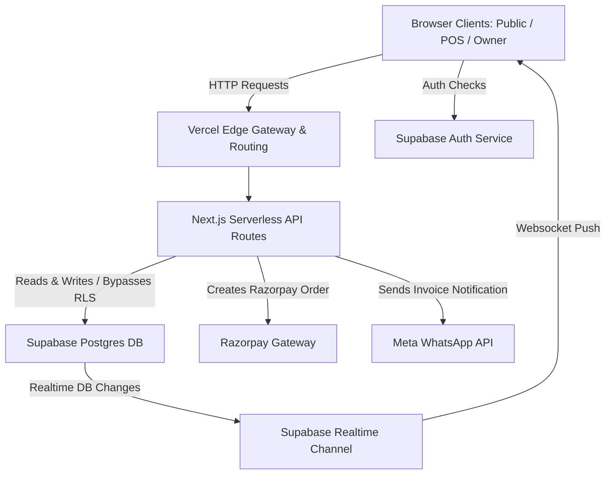
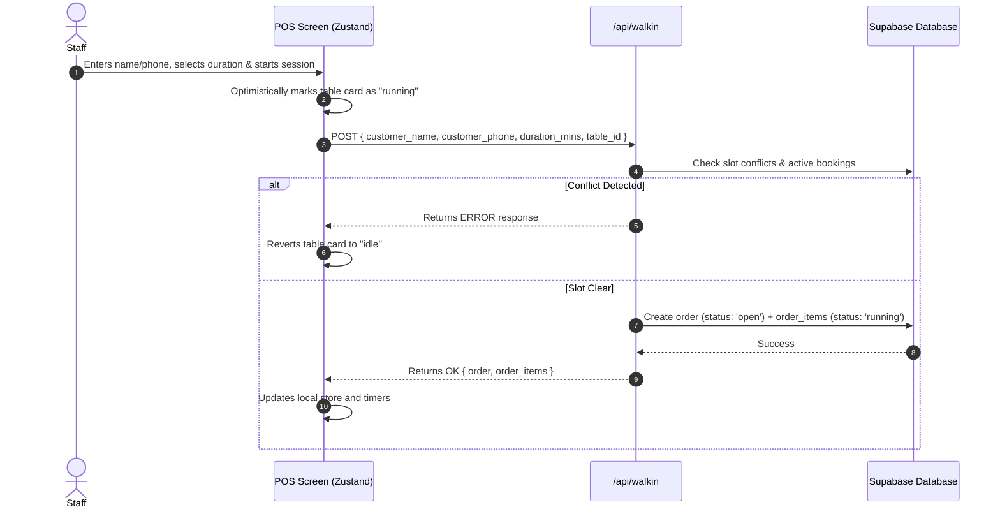
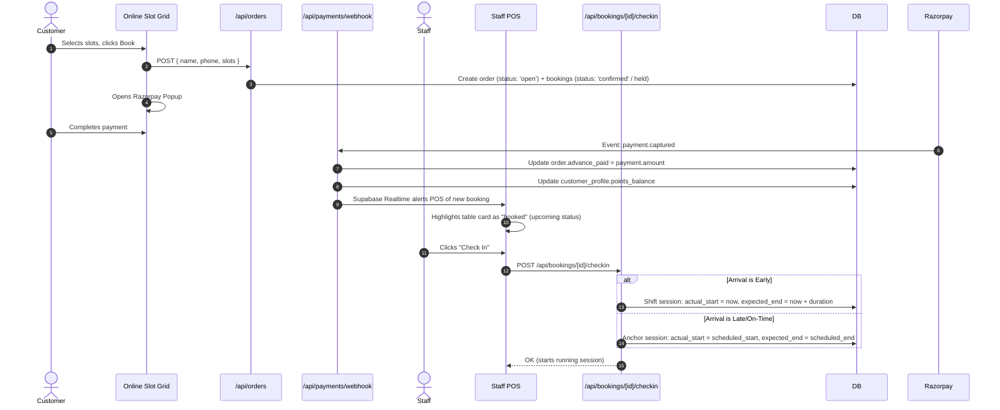
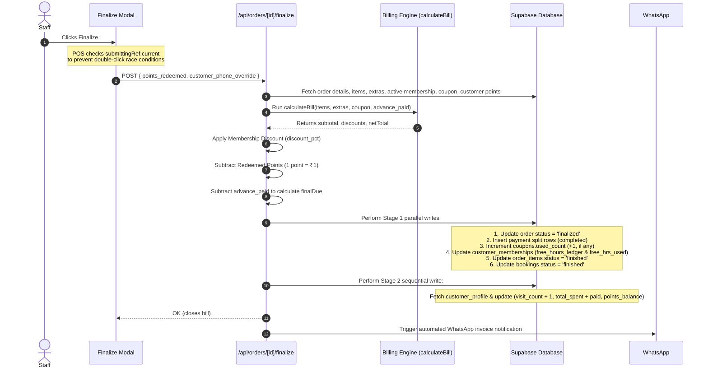
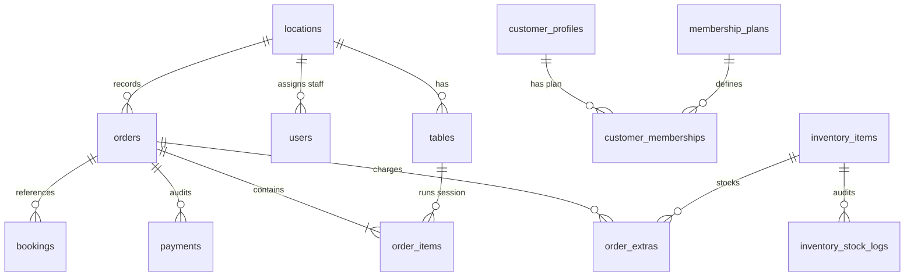

# Gamehaus — System Architecture & Technical Reference

This document serves as the authoritative technical reference for the Gamehaus project. It outlines the complete system design, database architecture, network data flows, state management, and external integrations.

---

## 1. High-Level Architecture Overview

Gamehaus uses a modern serverless model optimized for low latency and real-time synchronization.



The system is split into three scopes:
1. **Public Portal:** Serves static landing details, location pages with table slots grids, cart state (persisted locally), and handles payments.
2. **Staff POS Screen:** Single-page dashboard showing real-time table cards. Communicates via REST APIs and receives instant state mutations via Supabase WebSockets.
3. **Owner Dashboard:** Administrator panels for configuration (locations, tables, staff, inventory) and analytics/reports.

---

## 2. System Data Flows

### A. Walk-in Order Creation
Walk-in sessions start immediately when a customer arrives at the café.



### B. Online Booking & Check-In
Prepaid online bookings are reserved in advance and checked in by staff when the customer arrives.



### C. Finalization & Billing Flow
When a session concludes, the bill is calculated dynamically and finalized.



---

## 3. Database Layer

### Schema Blueprint



---

## 4. Real-time Synchronization Architecture

Real-time POS synchronization is built on top of Supabase Realtime Channels. It guarantees that multi-browser POS terminals and client bookings stay completely in sync.

### Subscription Matrix

```
  Supabase WebSocket Stream
          │
          ├──> pos-{locationId} Channel (POS screen)
          │         │
          │         ├──> order_items (*) ──> Updates timer, status, active item
          │         ├──> orders (*)      ──> Recalculates live bill preview
          │         ├──> tables (*)      ──> Syncs table availability
          │         └──> order_extras(*) ──> Refreshes bill breakdown
          │
          └──> public-slots-{locationId} Channel (Public portal)
                    │
                    └──> order_items, bookings ──> Bumps slotsTick counter to force
                                                   blocked range refetch in grid
```

---

## 5. Billing Engine & Loyalty Calculations

The billing engine calculations follow this sequence to compute final checkout balances:

1. **Subtotal Calculation:**
   $$\text{Subtotal} = \sum (\text{Billed Sessions}) + \sum (\text{Beverages \& Extras})$$

2. **Coupon Deduction:**
   $$\text{SubtotalAfterCoupon} = \max(0, \text{Subtotal} - \text{CouponDiscount})$$

3. **Free Hours Ledger Deduction:**
   For members covering running sessions, decrement duration hours directly from table-type buckets in `customer_memberships.free_hours_ledger`.
   $$\text{SubtotalAfterFreeHrs} = \max(0, \text{SubtotalAfterCoupon} - \text{FreeHoursValue})$$

4. **Membership Percentage Deduction:**
   $$\text{SubtotalAfterMembership} = \max(0, \text{SubtotalAfterFreeHrs} \times (1 - \frac{\text{DiscountPct}}{100}))$$

5. **Loyalty Points Deduction:**
   $$\text{TotalDue} = \max(0, \text{SubtotalAfterMembership} - (\text{PointsRedeemed} \times \text{RedeemRate}))$$

6. **Final Checkout Balance:**
   $$\text{finalDue} = \max(0, \text{TotalDue} - \text{advance\_paid})$$
